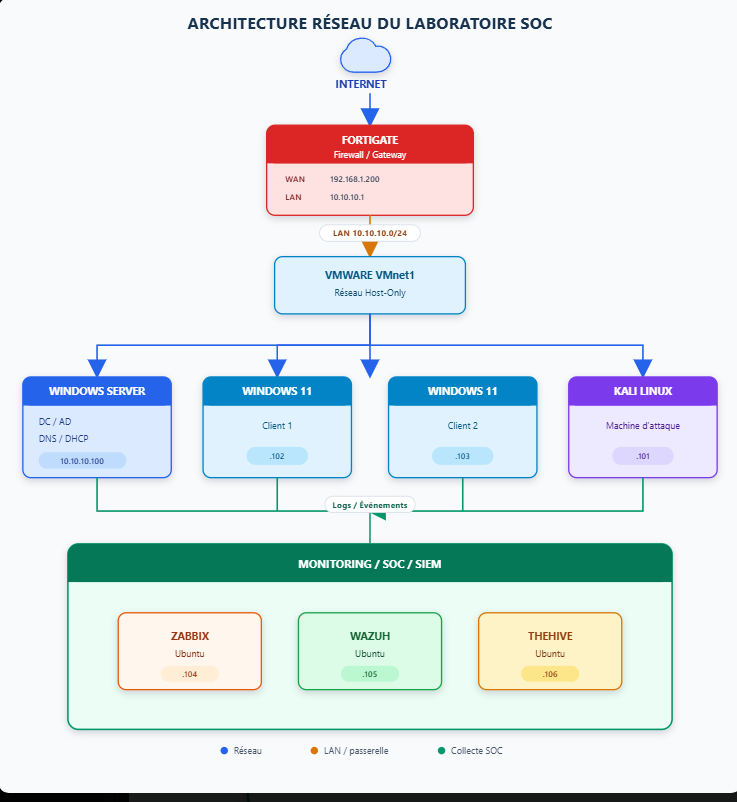
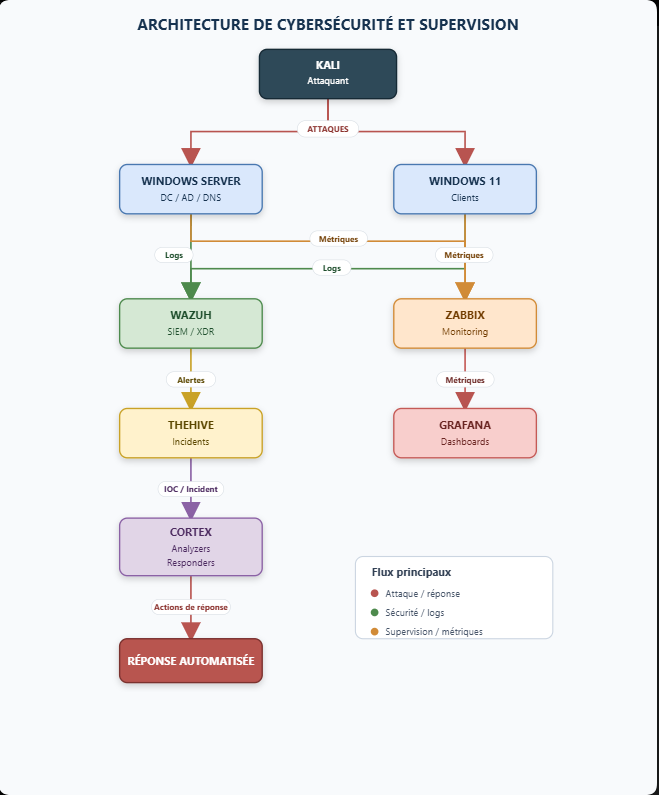

## WAZUH-Fortigate-Project

## Présentation du projet

## Présentation du laboratoire

Ce projet consiste à mettre en place un laboratoire virtualisé afin de développer mes compétences en administration de FortiGate, supervision, détection des menaces et réponse aux incidents au sein d’un environnement SOC.

L’objectif est de reproduire une petite infrastructure d’entreprise dans laquelle je pourrai administrer des systèmes, centraliser les journaux, surveiller les activités et simuler différents scénarios d’attaque.

## Architecture réseau

Le pare-feu FortiGate constitue la passerelle principale du laboratoire. Il sépare l’environnement de test du réseau physique de ma machine :

- L’interface WAN du FortiGate est connectée au réseau de ma machine physique. Elle utilise l’adresse `192.168.1.200`.
- L’interface LAN est connectée au réseau virtuel VMware `VMnet1`, configuré en mode Host-Only.
- Le réseau interne du laboratoire utilise le sous-réseau `10.10.10.0/24`.
- L’adresse `10.10.10.1` est attribuée à l’interface LAN du FortiGate et sert de passerelle aux machines du laboratoire.

Le réseau LAN représente le réseau interne de l’entreprise simulée.

## Ressources du laboratoire

L’environnement comprend les machines suivantes :

- Un serveur Windows Server, avec l’adresse `10.10.10.100`, utilisé pour administrer Active Directory, les utilisateurs, les ordinateurs, le DNS et le DHCP.
- Deux postes Windows 11 utilisés comme machines clientes.
- Une machine Kali Linux, avec l’adresse `10.10.10.101`, utilisée pour réaliser des tests de sécurité et simuler des attaques contrôlées.
- Un serveur Ubuntu hébergeant Wazuh.
- Un serveur Ubuntu hébergeant TheHive et Cortex dans des conteneurs.
- Un serveur Ubuntu destiné à héberger Zabbix pour la supervision des performances et des métriques de l’infrastructure.

## Fonctionnement du SOC

Des agents Wazuh seront installés sur les systèmes Windows et Linux afin de collecter leurs événements de sécurité et de surveiller leurs activités.

Le FortiGate transmettra également ses journaux à Wazuh, généralement au moyen du protocole Syslog.

Wazuh aura pour rôle de :

- Centraliser et analyser les journaux ;
- Détecter les activités inhabituelles ;
- Identifier les comportements suspects ;
- Générer des alertes de sécurité ;
- Détecter les attaques simulées depuis Kali Linux.

Les alertes pertinentes générées par Wazuh seront ensuite transmises à TheHive. Selon les règles d’intégration et d’automatisation configurées, TheHive pourra créer des alertes ou des dossiers d’incident afin de faciliter leur investigation.

Les indicateurs de compromission, tels que les adresses IP, noms de domaine, URL ou empreintes de fichiers, pourront être envoyés à Cortex. Les analyseurs Cortex permettront d’enrichir et d’évaluer automatiquement ces indicateurs. Des responders pourront ensuite être utilisés pour automatiser certaines actions de réponse.

Enfin, Zabbix sera ajouté afin de superviser la disponibilité des équipements, l’utilisation des ressources et les principales métriques de l’infrastructure.

## Objectifs pédagogiques

Ce laboratoire doit me permettre de pratiquer :

- La configuration et l’administration d’un pare-feu FortiGate ;
- L’administration d’un domaine Active Directory ;
- La segmentation et la sécurisation d’un réseau ;
- La centralisation et l’analyse des journaux avec Wazuh ;
- La simulation d’attaques depuis Kali Linux ;
- La détection et l’investigation des incidents ;
- La gestion des incidents avec TheHive ;
- L’analyse des indicateurs de compromission avec Cortex ;
- La supervision des systèmes et des métriques avec Zabbix ;
- L’automatisation progressive de la réponse aux incidents.

Toutes les attaques seront réalisées dans cet environnement isolé, uniquement à des fins d’apprentissage et de validation des mécanismes de détection.

## Architecture de mon lab

                                  │
               

